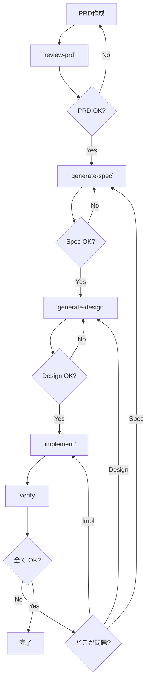

```mermaid
graph TD
    A[PRD作成] --> B[`review-prd`]
    B --> C{PRD OK?}
    C -->|No| A
    C -->|Yes| D[`generate-spec`]
    D --> E{Spec OK?}
    E -->|No| D
    E -->|Yes| F[`generate-design`]
    F --> G{Design OK?}
    G -->|No| F
    G -->|Yes| H[`implement`]
    H --> I[`verify`]
    I --> J{全て OK?}
    J -->|No| K{どこが問題?}
    K -->|Spec| D
    K -->|Design| F
    K -->|Impl| H
    J -->|Yes| L[完了]
```
