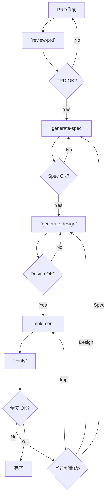

# Agentic Coding Workflow - Command Reference

PRD → Spec → Design → Implementation の流れで開発を進めるコマンド群

## Overview

```
┌─────────┐
│   PRD   │  ← 手動作成: ビジネス要件・Why/What
└────┬────┘
     │
     ▼
┌─────────────┐
│ /review-prd │  ← PRDの完成度をチェック・質問生成
└────┬────────┘
     │
     ▼
┌──────────────────┐
│ /generate-spec   │  ← API仕様・DBスキーマ・バリデーションルール
└────┬─────────────┘
     │ (人間がレビュー)
     ▼
┌──────────────────┐
│ /generate-design │  ← アーキテクチャ・技術選択・ADR
└────┬─────────────┘
     │ (人間がレビュー)
     ▼
┌──────────────┐
│ /implement   │  ← コード + テスト自動生成
└────┬─────────┘
     │
     ▼
┌──────────┐
│ /verify  │  ← (オプション) 整合性チェック
└──────────┘
```



## Commands

### 1. `/review-prd` - PRD レビュー

**目的:** PRD の完成度を検証し、曖昧な部分を質問で明確化

**使い方:**

```bash
/review-prd docs/prd/feature-name.md
```

**チェック項目:**

- Background & Purpose (なぜ作るのか)
- User Stories (誰が何をしたいのか)
- Success Criteria (成功の測定方法)
- Scope (作るもの/作らないもの)
- Non-functional requirements (性能・セキュリティ等)
- 関連ファイルパス・依存関係

**出力:**

- ✅ 完成している項目
- ⚠️ 不足・曖昧な項目
- ❓ 確認が必要な質問

---

### 2. `/generate-spec` - 仕様書生成

**目的:** PRD から機械可読な仕様書を生成（WHAT を定義）

**使い方:**

```bash
/generate-spec docs/prd/feature-name.md --output docs/spec/feature-spec.md
```

**生成内容:**

- **API 仕様:** エンドポイント・リクエスト/レスポンス形式
- **データモデル:** DB テーブル・カラム・制約・インデックス
- **バリデーションルール:** 入力検証・ビジネスルール
- **エラーコード:** 全エラーシナリオと対応
- **性能・制約:** レスポンスタイム・スループット・セキュリティ要件

**形式:** OpenAPI (REST) / Protobuf (gRPC) / Markdown (CLI)

---

### 3. `/generate-design` - 設計書生成

**目的:** HOW を定義 - アーキテクチャと技術選択

**使い方:**

```bash
/generate-design docs/prd/feature-name.md --spec docs/spec/feature-spec.md --output docs/design/feature-design.md
```

**生成内容:**

- **アーキテクチャ概要:** コンポーネント図・責務
- **技術決定 (ADR):** データベース選択・フレームワーク・非同期処理等の判断理由
- **重要なデータフロー:** 主要処理の流れ・エラーケース
- **実装方針:** レイヤー構造・パターン・実装フェーズ
- **非機能要件への対応:** 性能・信頼性をどう実現するか

**サイズ:** 1-2 ページ（簡潔に）

---

### 4. `/implement` - 実装生成

**目的:** Spec + Design に基づいてコードとテストを自動生成

**使い方:**

```bash
/implement docs/prd/feature-name.md --spec docs/spec/feature-spec.md --design docs/design/feature-design.md --output-dir ./
```

**生成内容:**

- **プロダクションコード:** Design のフェーズに従って実装
- **テストコード:** Unit / Integration / E2E
- **マイグレーション:** Spec の DB スキーマ
- **設定ファイル:** 必要に応じて
- **README:** クイックスタートガイド

**検証:**

- コンパイル/実行確認
- 全テスト実行
- Spec 契約の実装確認
- コーディング規約チェック

---

### 5. `/verify` - 整合性検証 (オプション)

**目的:** PRD/Spec/Design/Implementation の整合性をチェック

**使い方:**

```bash
/verify docs/prd/feature-name.md --spec docs/spec/feature-spec.md --design docs/design/feature-design.md --impl ./internal/
```

**検証項目:**

- PRD ↔ Spec: 全ユーザーストーリーが Spec でカバーされているか
- Spec ↔ Design: 全 API・スキーマが Design で考慮されているか
- Design ↔ Implementation: アーキテクチャが実装に反映されているか
- Spec ↔ Implementation: API 契約が正確に実装されているか
- テストカバレッジ: Spec のバリデーションルールがテストされているか

**出力:** ✅/⚠️/❌ で問題箇所を報告

---

## 実践例: レストラン予約システム

```bash
# 1. PRDを手動作成
vim docs/prd/reservation-system.md

# 2. PRDレビュー
/review-prd docs/prd/reservation-system.md
# → 質問に回答してPRDを修正
# → 再度レビューして ✅ になるまで繰り返す

# 3. Spec生成
/generate-spec docs/prd/reservation-system.md --output docs/spec/reservation-spec.md
# → API仕様・DBスキーマをレビュー
# → 必要なら修正して再生成

# 4. Design生成
/generate-design docs/prd/reservation-system.md --spec docs/spec/reservation-spec.md --output docs/design/reservation-design.md
# → アーキテクチャ・技術選択をレビュー
# → 問題なければ次へ

# 5. 実装生成
/implement docs/prd/reservation-system.md --spec docs/spec/reservation-spec.md --design docs/design/reservation-design.md
# → コード + テストが生成される
# → テスト実行して確認

# 6. 整合性確認 (任意)
/verify docs/prd/reservation-system.md --spec docs/spec/reservation-spec.md --design docs/design/reservation-design.md --impl ./internal/
```

---

## Why This Flow?

### PRD → Spec → Design → Implementation の利点

**1. 段階的な具体化**

- PRD: ビジネス価値・Why/What
- Spec: 機能仕様・契約
- Design: 技術選択・How
- Implementation: 実際のコード

→ 各段階で人間がレビューできる

**2. トレーサビリティ**

- 各成果物が前段階を参照
- なぜこの実装なのか追跡可能
- 変更時の影響範囲が明確

**3. 品質の前倒し**

- PRD の曖昧さを早期に発見
- Spec 段階で API 設計を確定
- Design 段階で技術的リスクを検討
- Implementation 時に迷わない

**4. AI Agent との協働**

- 各段階で明確な成果物
- AI は前段階の成果物を参照して次を生成
- 人間は各段階でレビュー・修正可能

---

## ディレクトリ構成例

```
project/
├── docs/
│   ├── prd/
│   │   └── feature-name.md          # 手動作成
│   ├── spec/
│   │   └── feature-name-spec.md     # /generate-spec で生成
│   └── design/
│       └── feature-name-design.md   # /generate-design で生成
├── internal/                         # /implement で生成
│   ├── domain/
│   ├── usecase/
│   └── adapter/
├── cmd/
├── migrations/
└── tests/
```

---

## Notes

- **各段階で人間がレビュー**: 自動生成されたものを必ず確認
- **反復可能**: 問題があれば前の段階に戻って修正
- **柔軟性**: プロジェクトに応じてコマンドをカスタマイズ可能
- **サイズ感**: 各コマンドは 30-60 行程度でシンプル

---

## Next Steps

1. この README を参考に、実際のプロジェクトで試す
2. コマンドを `claude.md` や専用ディレクトリに配置
3. プロジェクトに合わせてコマンドをカスタマイズ
4. 使いながら改善していく
